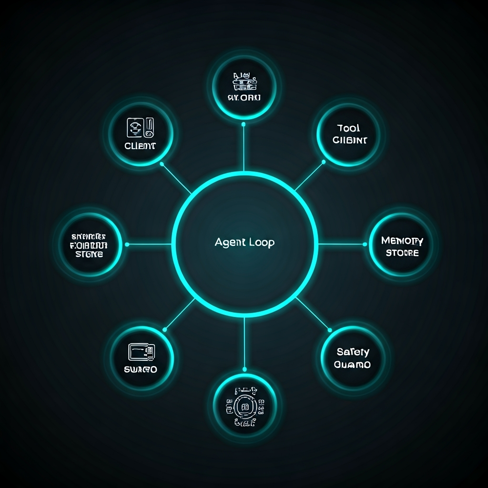
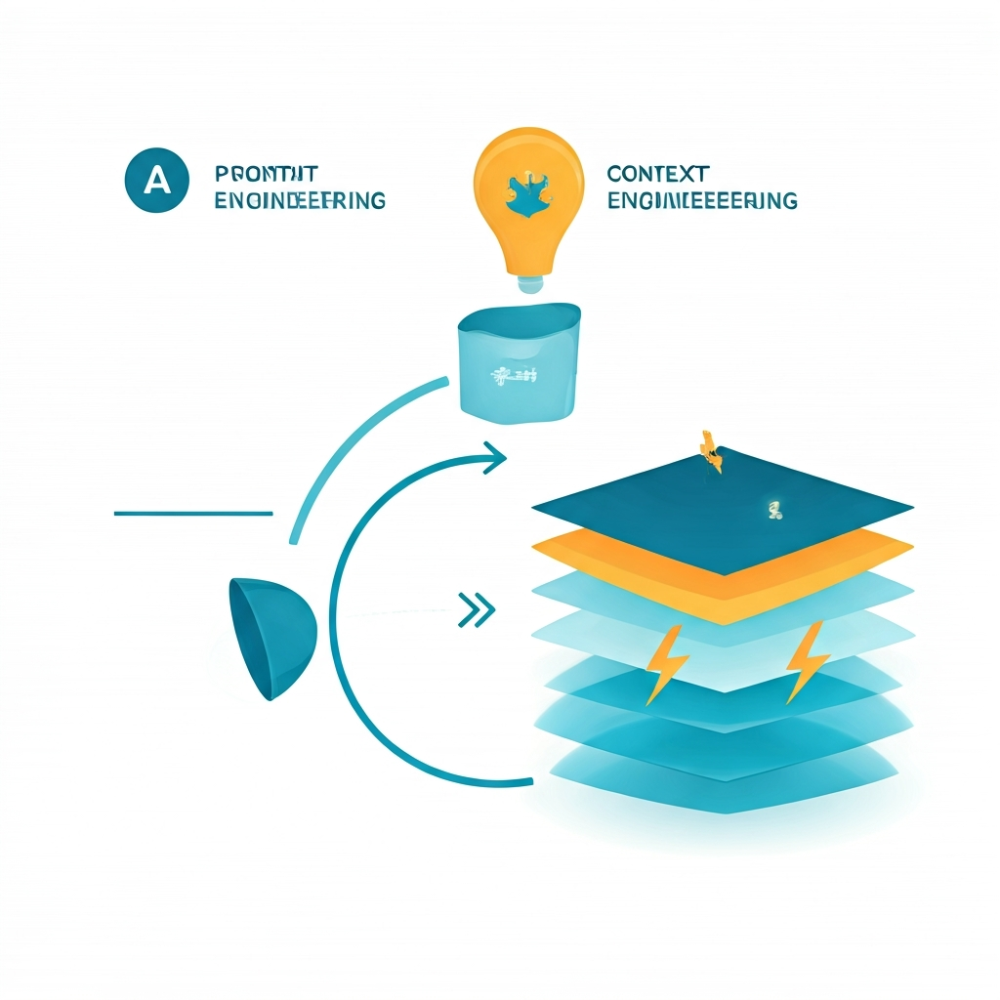
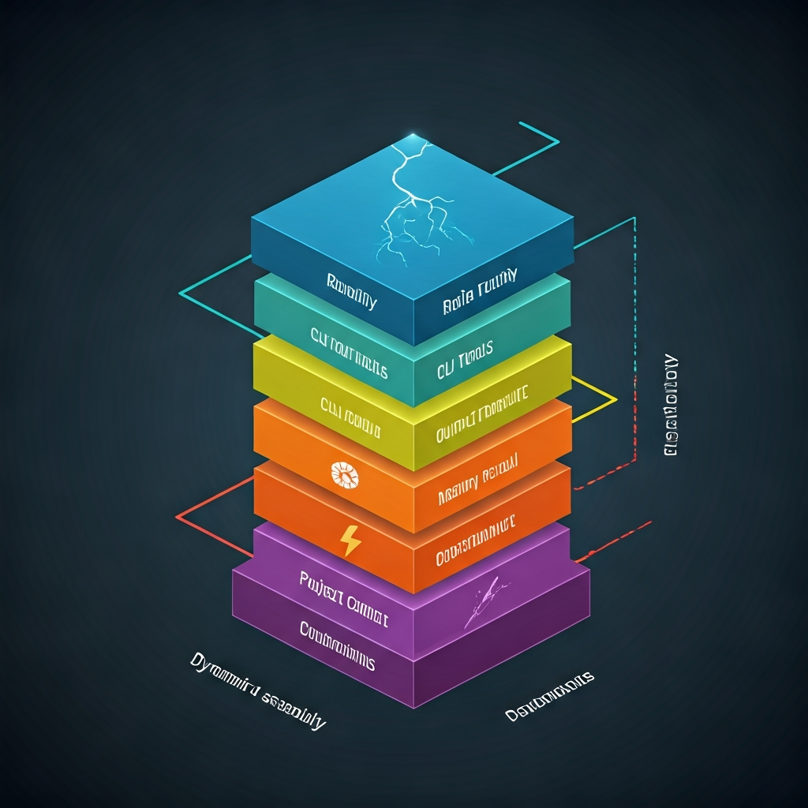
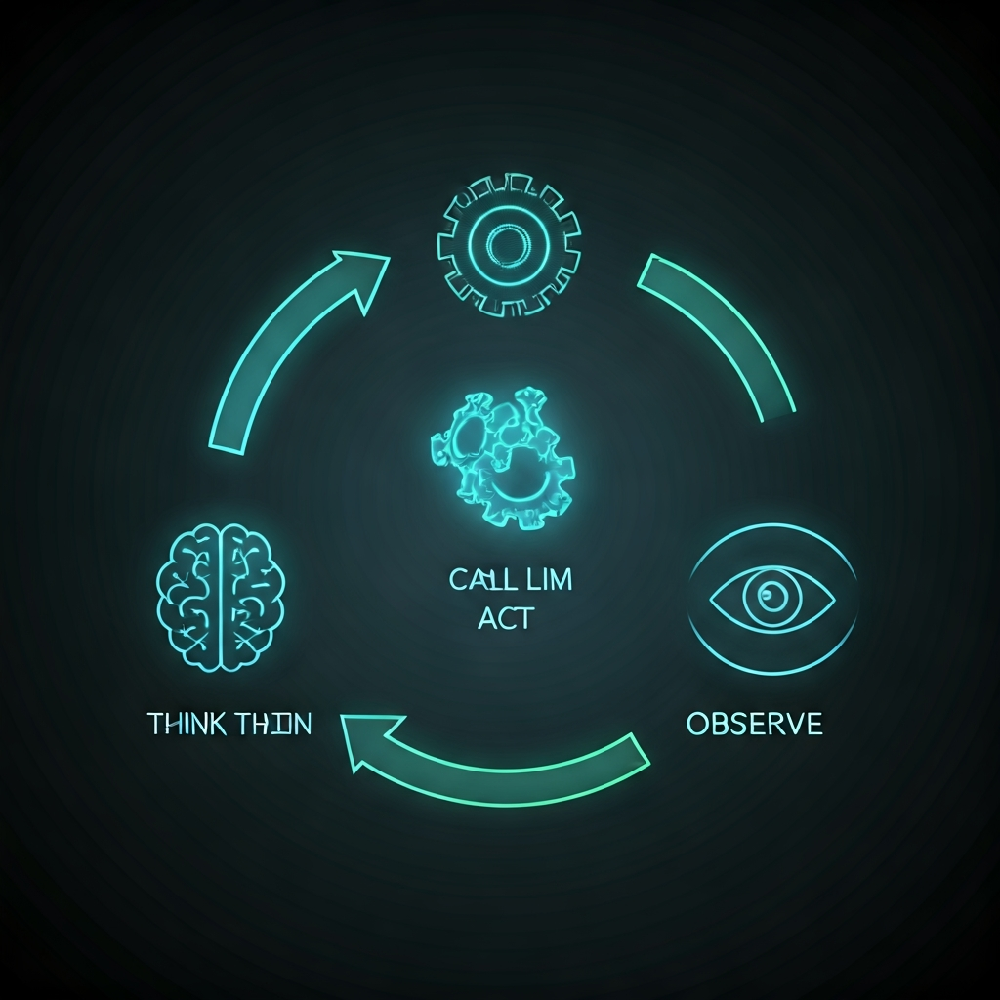
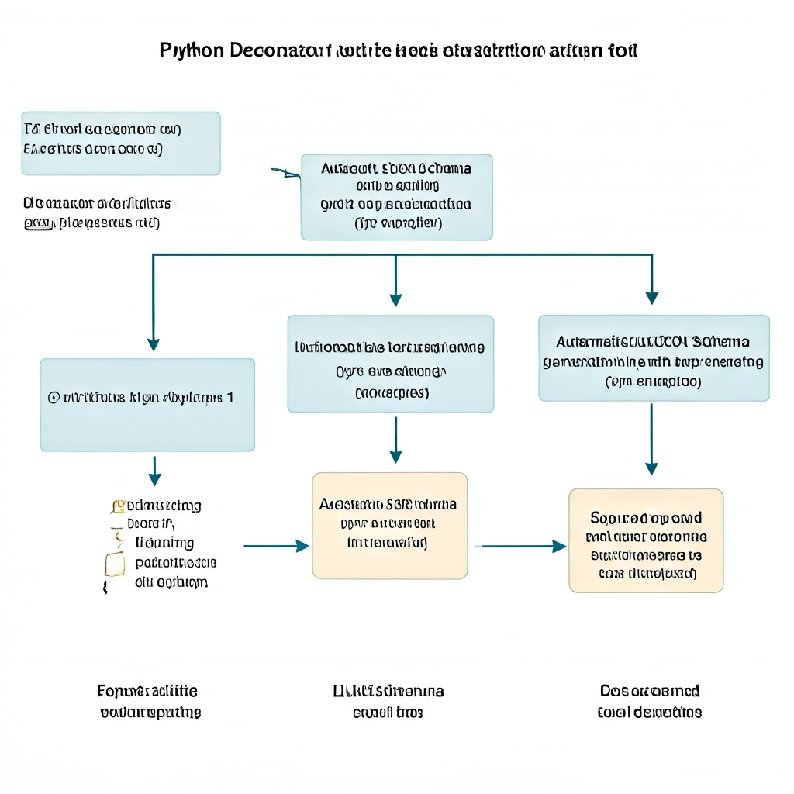
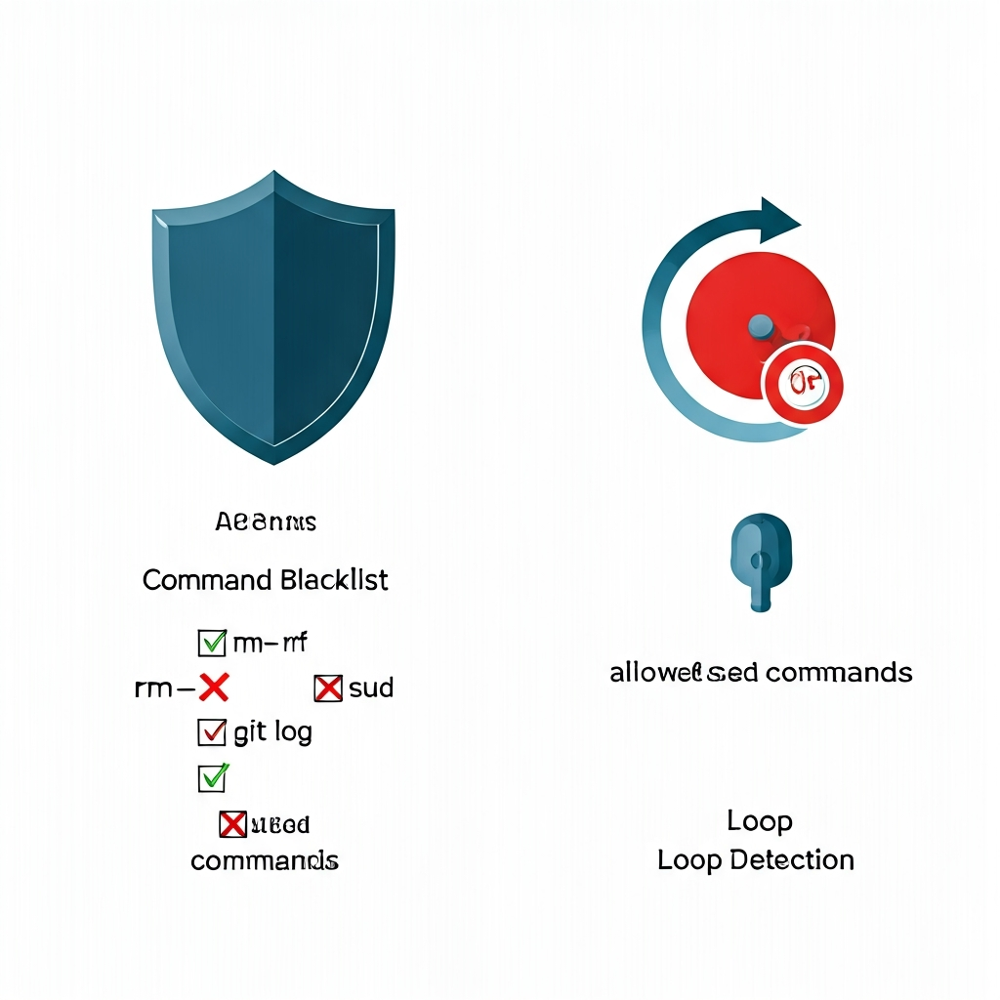
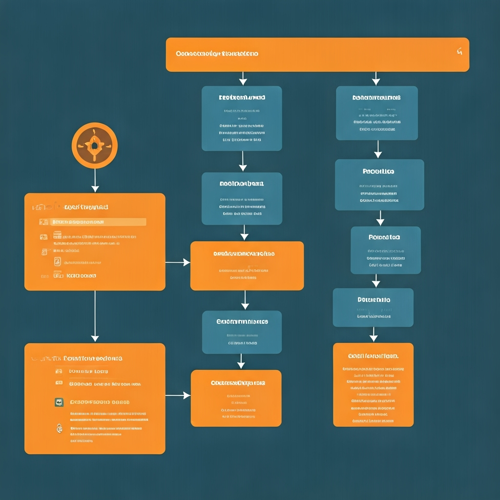
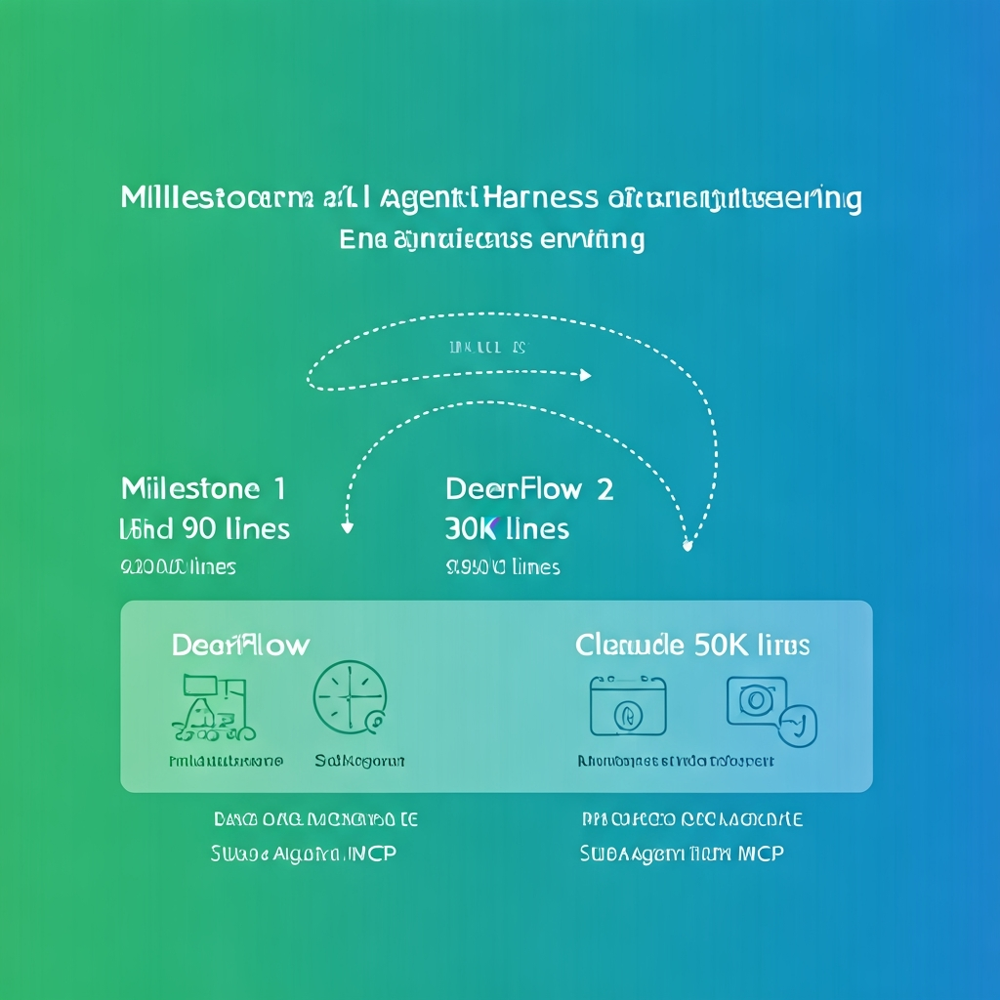

# land — Landing Knowledge Assistant

> 最小但完整的 Agent Harness (902 行 Python)，帮助新人快速理解接手的系统。

```bash
cd /path/to/new-repo && land
```

---

## Quick Start

```bash
git clone https://github.com/ava-agent/mini-harness.git
cd mini-harness
pip install -e .

export GLM_API_KEY=your-api-key

cd /path/to/your/repo
land                              # 交互模式
land -p "分析这个项目的架构"        # One-shot 模式
land --session 2026-03-31-143022  # 恢复会话
```

| 命令 | 说明 |
|------|------|
| `/memory` | 查看已记忆的事实 |
| `/output` | 查看输出目录 |
| `/session` | 当前会话信息 |
| `/sessions` | 列出所有会话 |
| `/help` | 帮助 |
| `/quit` | 保存并退出 |

---

## Part 1: 什么是 Agent Harness

### 一个类比

```
LLM = CPU        (提供原始智能，但单独不能做任何事)
Harness = OS     (提供文件系统、进程管理、安全层、I/O)
Agent = App      (在 OS 上运行的应用程序)
```

**没有 Harness 的 LLM** 就像没有操作系统的 CPU——能计算，但不能持续工作、不能记忆、不能安全地与外部交互。

### Harness 的组成



一个完整的 Agent Harness 包含 6 个子系统：

| 子系统 | land 里的文件 | 解决什么问题 |
|--------|-------------|-------------|
| **Agent Loop** | `agent.py` | Agent 怎么持续地思考和行动 |
| **Tool Integration** | `tools.py` | Agent 怎么使用外部工具 |
| **Context Engineering** | `prompt.py` | Agent 怎么理解自己的角色和边界 |
| **Memory** | `memory.py` | Agent 怎么记住之前的发现 |
| **Safety** | `safety.py` | Agent 怎么避免做危险的事 |
| **LLM Client** | `llm.py` | Agent 怎么和大模型通信 |

**land 用 902 行代码实现了所有 6 个。** 每个文件就是一个子系统，阅读顺序 = 学习顺序。

---

## Part 2: 从零理解 — 你输入 `land` 后发生了什么

### Step 1: 启动

```bash
$ land /path/to/repo
land v0.1 — Landing Knowledge Assistant
Project: /path/to/repo
Session: 2026-03-31-150000
>
```

启动时做了什么：
1. 初始化 `LLMClient`（连接 GLM API）
2. 加载 `ToolRegistry`（注册 6 个内置工具）
3. 创建 `MemoryStore`（新 session 或恢复旧 session）
4. 创建 `SafetyGuard`（加载黑名单规则）
5. 组装 `Agent`（把上面 4 个组件连起来）

### Step 2: 你输入一个问题

```
> 帮我了解这个项目的整体结构
```

### Step 3: Prompt 组装 (prompt.py)



**这是 Harness 最关键的理念转变：**

```
旧思路 (Prompt Engineering):
  写一段固定的提示词 → 发给 LLM → 希望它表现好

新思路 (Context Engineering):
  每次调用动态组装上下文 → 注入当前记忆 → 注入当前项目 → 发给 LLM
```



`prompt.py` 像搭积木一样组装 System Prompt：

```python
def build_system_prompt(memory_recall="", project_path=""):
    sections = [
        ROLE_SECTION,              # 1. "你是 Landing 知识助手"
        CLI_TOOLS_SECTION,         # 2. "你可以用 git, gh, glab..."
        OUTPUT_STRUCTURE_SECTION,  # 3. "INDEX.md 的模板是..."
        memory_recall,             # 4. "你已经知道: ..." (动态!)
        project_context,           # 5. "当前项目: /path/..." (动态!)
        CONSTRAINTS_SECTION,       # 6. "不要修改源码，不要..."
    ]
```

**为什么每次都重新组装？** 因为第 4 段（记忆）在变——Agent 每发现一个事实，下一轮的 System Prompt 就多一条记忆。

**对比 Claude Code**：Claude Code 的 System Prompt 更复杂，有 System Reminder（对抗 LLM 的"指令遗忘"）和 Prompt Cache（利用前缀缓存降低延迟）。但核心思想一样：**分段组装，按需注入**。

### Step 4: Agent Loop (agent.py)



System Prompt 组装好后，进入核心循环：

```python
for iteration in range(15):           # 最多 15 轮
    response = llm.chat(messages)      # Think: LLM 思考

    if no tool_calls:
        return response.content        # Done: 返回文本

    for tc in tool_calls:              # Act: 执行工具
        safety_check(tc)               #   安全检查
        result = tools.execute(tc)     #   执行
        messages.append(result)        #   Observe: 结果回传

    continue                           # 回到 Think
```

**这就是 Harness 的心脏。** 三个阶段不断循环：

| 阶段 | 做什么 | 对应代码 |
|------|--------|---------|
| **Think** | 把所有信息发给 LLM，让它决定下一步 | `llm.chat(messages)` |
| **Act** | LLM 返回 tool_calls，执行对应工具 | `tools.execute(name, args)` |
| **Observe** | 工具结果作为新消息回传给 LLM | `messages.append(tool_result)` |

**一个真实例子**：

```
Think #1: LLM 收到 "帮我了解项目结构"
  → LLM 决定: 先调用 list_dir

Act #1: 执行 list_dir(".", depth=2)
  → 返回: "src/\n  order/\n  inventory/\n  config/\nREADME.md\n..."

Observe #1: 结果回传给 LLM

Think #2: LLM 看到目录结构，决定读 README
  → LLM 决定: 调用 read_file("README.md")

Act #2: 执行 read_file("README.md")
  → 返回: "# Order System\nA fulfillment platform..."

Observe #2: 结果回传给 LLM

Think #3: LLM 现在有了足够信息
  → LLM 返回文本: "这是一个订单履约系统，核心模块包括..."

Done! 返回给用户。
```

**3 轮循环，Agent 就完成了"看目录 → 读关键文件 → 总结回答"的过程。** 就像一个有经验的工程师第一次看一个新项目的操作：先看骨架，再看入口，然后形成理解。

### Step 5: 工具执行 (tools.py)



**Agent 怎么知道有哪些工具？** 通过 JSON Schema：

```python
# 你写的 Python 函数:
@tool(description="读取文件内容，返回带行号的文本")
def read_file(path: str, limit: int = 200) -> str:
    """path: 文件的绝对或相对路径
    limit: 最多读取的行数"""

# @tool 自动生成的 JSON Schema (发给 LLM):
{
  "type": "function",
  "function": {
    "name": "read_file",
    "description": "读取文件内容，返回带行号的文本",
    "parameters": {
      "type": "object",
      "properties": {
        "path": {"type": "string", "description": "文件的绝对或相对路径"},
        "limit": {"type": "integer", "description": "最多读取的行数"}
      },
      "required": ["path"]
    }
  }
}
```

**LLM 看到 Schema，就知道可以调用 `read_file(path="src/main.py")`。** 这就是 OpenAI function-calling 协议的核心。

#### 6 个内置工具

| 工具 | 行数 | 用途 | Landing 场景 |
|------|------|------|-------------|
| `read_file` | 14 | 读文件（带行号、限制行数） | 读代码、读配置 |
| `list_dir` | 23 | 列目录（树状、深度控制） | 了解项目骨架 |
| `search_code` | 18 | 搜索模式（优先用 rg） | 找关键类、找调用链 |
| `run_command` | 13 | 执行 shell 命令 | git log、gh pr list |
| `write_file` | 7 | 写文件（自动创建目录） | 产出知识地图 |
| `memorize` | 5 | 记住发现 | 跨会话保持认知 |

**`run_command` 是最强大的工具**——通过它可以调用任何系统 CLI：

```bash
# Agent 可以这样调用:
run_command("git log --oneline -20")           # 看最近提交
run_command("git shortlog -sn")                # 看贡献者
run_command("gh issue list --state open")      # 看 GitHub Issue
run_command("glab mr list")                    # 看 GitLab MR
run_command("wc -l src/**/*.java")             # 统计代码量
```

**添加新工具只需 5 行**：

```python
@tool(description="获取 Git 仓库的贡献者统计")
def git_contributors(path: str = ".") -> str:
    """path: Git 仓库路径"""
    result = subprocess.run(
        ["git", "-C", path, "shortlog", "-sn", "--all"],
        capture_output=True, text=True, timeout=15)
    return result.stdout.strip() or "(no contributors)"
```

不需要改任何其他文件——`@tool` 自动注册，Agent 自动发现。

### Step 6: 安全检查 (safety.py)



每次工具调用前都要过两道检查：

#### 检查 1: 命令黑名单

```python
# Agent 想执行 "rm -rf /"
safety.check_command("rm -rf /")
# → (False, "Blocked: matches dangerous pattern 'rm\s+-rf'")
# → 拒绝执行，原因回传给 LLM，LLM 会换一种方式

# 黑名单里有 13 个模式:
BLOCKED = ["rm -rf", "sudo", "mkfs", "shutdown", "reboot",
           "git push --force", "git reset --hard", "chmod 777", ...]
```

#### 检查 2: 循环检测 (Doom Loop Detection)

```python
# Agent 连续 3 次调用同样的 read_file("config.yaml")
safety.check_loop("read_file", {"path": "config.yaml"})
# 第 1 次: (True, "")  — 正常
# 第 2 次: (True, "")  — 可能是 retry
# 第 3 次: (False, "Loop detected") — 停！换一种方式

# 每次用户发新消息时重置计数器
safety.reset_loop()
```

**为什么需要循环检测？** 因为 LLM 有概率会陷入 Doom Loop——一直重复同样的操作。这是 Agent 特有的问题，传统软件没有。

**对比 Claude Code 的 5 层安全**：

```
Claude Code 安全纵深:
├── Layer 1: AST 静态分析 (代码注入检测)     ← land 没有
├── Layer 2: Allow/Deny 列表                ← land 的黑名单
├── Layer 3: Runtime Approval (用户确认)     ← land 没有
├── Layer 4: Docker 沙箱 (进程隔离)          ← land 没有
└── Layer 5: Audit Log (操作审计)            ← land 没有

land 的 2 层 (黑名单 + 循环) 是最小但最关键的子集。
扩展方向: 先加 "用户确认"，再加沙箱。
```

### Step 7: 记忆持久化 (memory.py)

当 Agent 调用 `memorize("order-service 是核心模块", "list_dir 结果")` 时：

```python
# agent.py 拦截 memorize 调用:
if name == "memorize":
    self.memory.add(fact=args["fact"], source=args["source"])

# memory.py 存入 JSON:
{
  "session_id": "2026-03-31-150000",
  "facts": [
    {
      "fact": "order-service 是核心模块",
      "source": "list_dir 结果",
      "timestamp": "2026-03-31T15:01:23"
    }
  ]
}

# 下一轮 LLM 调用时，prompt.py 会注入:
# "## 已知事实
#  - order-service 是核心模块 (source: list_dir 结果)"
```

**关键设计: Token 预算**

```python
def recall(self, token_budget=2000):
    char_budget = token_budget * 4  # ~4 chars/token 估算
    for entry in reversed(self._facts):  # 最近的优先
        if used + len(line) > char_budget:
            break  # 超预算就停!
```

**为什么不全部返回？** 因为 LLM 的上下文窗口是有限资源。100 条记忆可能占用 2000 token，挤掉了当前对话的空间。这就是**上下文经济学**——Ryan Lopopolo 说的"上下文是稀缺资源"。

**对比其他 Harness 的记忆系统**：

```
land:          JSON 列表 + token 预算 → 最简单
Claude Code:   MEMORY.md 文件 + frontmatter 类型标签 → 结构化
DeerFlow:      LLM 自动提取事实 + 置信度评分 → 最智能
Dapr Agents:   Dapr State Store (28+ 可插拔后端) → 最可扩展
```

### Step 8: 产出知识地图



当你说"帮我生成知识地图"，Agent 会按模板创建：

```
output/order-system/
├── INDEX.md                ← 入口地图 (~100 行)
├── architecture.md         ← 分层架构 + 模块关系
├── modules/
│   ├── order-service.md   ← 职责、入口文件、依赖
│   ├── inventory.md
│   └── dispatch.md
├── people.md               ← @张三 — order owner
├── risks.md                ← 分布式锁竞争问题
├── glossary.md             ← "履约" = fulfillment
└── onboarding-checklist.md ← [ ] 跑通本地环境
```

**INDEX.md 的核心原则** (来自 Ryan Lopopolo, OpenAI):

> "给人地图，不是说明书。~100 行入口 + 指针 + 渐进发现。"

```markdown
# Order System — 知识地图
> 生成时间: 2026-03-31 | 来源: git repo

## 一句话
订单履约系统，从下单到配送完成。日均 500 万单。

## 核心模块 (详见 modules/)
- [order-service](modules/order-service.md) — 订单生命周期 ★最复杂
- [inventory](modules/inventory.md) — 库存扣减与回补

## 关键人 (详见 people.md)
- @张三 — order-service owner

## 需要注意 (详见 risks.md)
- ⚠️ 分布式锁竞争问题
```

**每条都是指针，不内联详情。** 这和 AGENTS.md / CLAUDE.md 的设计原则完全一致——map, not manual.

---

## Part 3: 和 Claude Code / DeerFlow 对比学习



### 全景对比

```
                        land            Claude Code         DeerFlow 2.0
                        ────            ───────────         ────────────
代码量                   902 行          ~50K+ 行            ~30K+ 行
定位                    学习用 Harness   终端 Agent Harness   SuperAgent Harness
─────────────────────────────────────────────────────────────────────────
Agent Loop              ✅ 15 轮         ✅ 复杂嵌套          ✅ LangGraph 状态机
工具系统                 6 个            ~20 个              ~15 个 (5 来源)
上下文工程               ✅ 分段组装      ✅ System Reminder   ✅ 14 阶段中间件
记忆                    ✅ JSON 文件     ✅ MEMORY.md         ✅ 置信度事实系统
安全                    ✅ 2 层          ✅ 5 层纵深          ✅ Guardrail 中间件
─────────────────────────────────────────────────────────────────────────
沙箱                    ❌              ✅ 进程隔离           ✅ Docker
Sub-Agent               ❌              ✅ Agent Teams       ✅ 双线程池
MCP                     ❌              ✅ 原生              ✅ OAuth
Streaming               ❌              ✅                   ✅
Skill/Plugin            ❌              ✅ /commit等         ✅ 渐进加载
上下文压缩              ❌              ✅ Compact           ✅ Summarization
```

### 每个模块的进化方向

#### Agent Loop 进化

```
land (你现在在这里):
  简单 for 循环，最多 15 轮
  ↓
DeerFlow:
  LangGraph 状态机，支持分支和并行
  + 14 阶段中间件管道 (每个中间件处理一个 Agent 特有问题)
  ↓
Claude Code:
  嵌套 Agent Loop (SubAgent 可再产生 SubAgent)
  + 上下文自动压缩 (Compact)
  + Hooks (PreToolUse / PostToolUse 生命周期事件)
```

#### 工具系统进化

```
land:
  @tool 装饰器 + 6 个内置工具
  ↓
DeerFlow:
  5 来源动态组装 (内置 + Skill + MCP + SubAgent + 用户自定义)
  + Skill 渐进加载 (不一次性加载所有工具，按需发现)
  ↓
Claude Code:
  ~20 个内置工具 + MCP 延迟加载 (ToolSearch 按需发现)
  + Agent 工具 (一个工具可以启动一个新 Agent)
  + 权限控制 (Ask/Allow/Deny per tool)
```

#### 记忆系统进化

```
land:
  JSON 文件 + token 预算
  ↓
DeerFlow:
  LLM 自动提取事实 + 置信度评分 + 语义检索
  ↓
Claude Code:
  MEMORY.md 文件系统 + 类型标签 (user/feedback/project/reference)
  + 自动检测过时记忆
  + 引用前验证 (记忆说文件存在 → grep 确认)
```

#### 安全系统进化

```
land:
  命令黑名单 + 循环检测 (62 行)
  ↓
DeerFlow:
  + Guardrail 中间件 (基于 LLM 的内容审查)
  + DanglingToolCall 处理 (LLM 输出格式错误)
  ↓
Claude Code:
  5 层纵深防御:
  ├── AST 静态分析 (检测代码注入)
  ├── Allow/Deny 列表 (工具级权限)
  ├── Runtime Approval (用户交互确认)
  ├── Docker/Worktree 沙箱 (进程隔离)
  └── Audit Log (操作审计)
```

---

## Part 4: 动手扩展

### 扩展优先级

```
P0 (马上有用):
├── .env 文件支持 — 不用每次 export
├── Streaming 输出 — 不用等 LLM 全部生成完
└── 上下文压缩 — history 太长时自动 summarize

P1 (提升体验):
├── 交互式确认 — 高危操作前问用户 "确认执行?"
├── 更好的循环检测 — sliding window 而非精确匹配
└── 彩色 Markdown 渲染 — 终端里渲染 Agent 的 MD 输出

P2 (接近 Claude Code):
├── SubAgent — 大任务分解成子任务
├── MCP 支持 — 接入 MCP Server 获取更多工具
├── Plugin/Skill — 可扩展的能力
└── 向量记忆 — 语义检索而非全量召回
```

### 示例: 添加 .env 支持 (P0)

```python
# 在 cli.py 的 main() 开头加:
from pathlib import Path

env_file = Path(".env")
if env_file.exists():
    for line in env_file.read_text().splitlines():
        if "=" in line and not line.startswith("#"):
            key, val = line.split("=", 1)
            os.environ.setdefault(key.strip(), val.strip())
```

### 示例: 添加用户确认 (P1)

```python
# 在 agent.py 的 safety check 后加:
CONFIRM_PATTERNS = [re.compile(r"\bgit\s+push\b"), re.compile(r"\bwrite_file\b")]

for pattern in CONFIRM_PATTERNS:
    if pattern.search(str(args)):
        answer = input(f"  ⚠️  Confirm {name}({args})? [y/N] ")
        if answer.lower() != "y":
            result = "[CANCELLED] User denied"
            break
```

---

## Part 5: 源码导读 — 推荐阅读顺序

```
阅读顺序     文件           行数    你会学到什么
─────────   ────────────  ────    ──────────────────────────
1 (最简单)   llm.py         41    OpenAI 兼容协议、模型抽象
2 (核心模式) tools.py       217    @tool 装饰器、JSON Schema、6 个工具实现
3 (安全思维) safety.py       62    命令黑名单、循环检测、Agent 特有风险
4 (持久化)   memory.py       95    JSON 存储、Token 预算、上下文经济学
5 (上下文)   prompt.py      135    分段组装、动态注入、Harness Engineering
6 (心脏)     agent.py       171    Agent Loop、tool_call 协议、消息格式
7 (入口)     cli.py         180    REPL、特殊命令、用户体验

代码量分布:
  工具层最多 (217行) — Agent 的价值在于使用工具
  LLM 层最少 (41行)  — 调用 LLM 本身不产生价值
  其余都是 "围绕 LLM 的基础设施" — 这就是 Harness
```

**阅读每个文件时，问自己三个问题**：
1. 这个模块解决了什么 Agent 特有的问题？
2. Claude Code / DeerFlow 在同一个问题上做了什么更复杂的设计？
3. 如果我要扩展这个模块，下一步加什么？

---

## Part 6: 学习资料

### 核心概念

| 资源 | 读完你会理解 |
|------|-------------|
| [Harness Engineering (Ryan Lopopolo, OpenAI)](https://openai.com/index/harness-engineering/) | 为什么 land 的产出是"地图不是说明书" |
| [Building Effective Agents (Anthropic)](https://docs.anthropic.com/en/docs/build-with-claude/prompt-engineering/building-effective-agents) | 为什么 agent.py 是 Think→Act→Observe 循环 |
| [Context Engineering (Torantulino)](https://www.latent.space/p/context-engineering) | 为什么 prompt.py 每次动态组装而非写死 |
| [Harness Engineering (Martin Fowler)](https://martinfowler.com/articles/building-agents-with-harness.html) | 工程视角的 Harness 六大子系统 |

### 参考实现

| 项目 | 读完你会理解 |
|------|-------------|
| [Claude Code 官方文档](https://docs.anthropic.com/en/docs/claude-code) | land 的每个模块在完整 Harness 里长什么样 |
| [DeerFlow GitHub](https://github.com/bytedance/deer-flow) | 14 阶段中间件怎么解决 Agent 特有问题 |
| [OpenAI Function Calling](https://platform.openai.com/docs/guides/function-calling) | tools.py 的 JSON Schema 格式为什么这么写 |

### 协议标准

| 协议 | 和 land 的关系 |
|------|---------------|
| [MCP (Model Context Protocol)](https://modelcontextprotocol.io/) | land 未来接入更多工具的标准方式 |
| [A2A (Agent-to-Agent)](https://github.com/google/A2A) | land 未来和其他 Agent 协作的标准方式 |

---

## License

MIT
